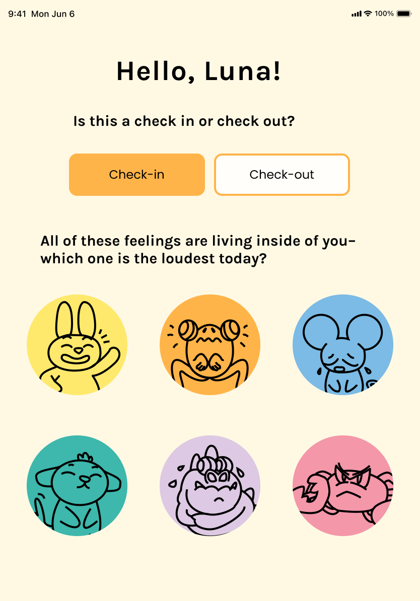
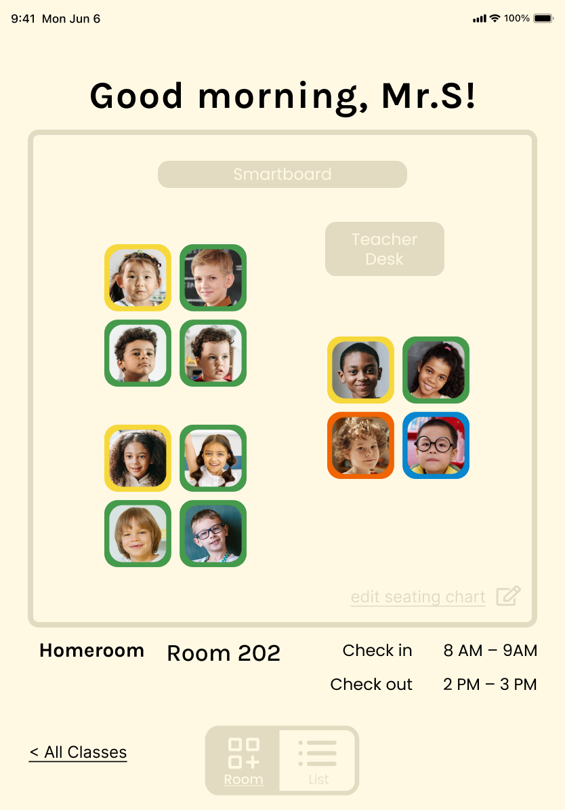
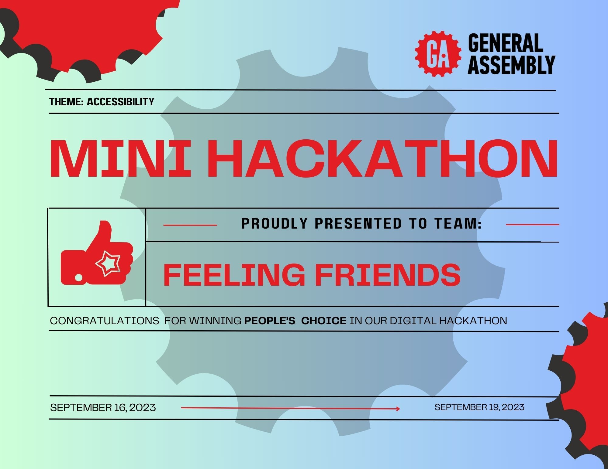

# Feeling Friends App

## Overview

Feeling Friends is a user-friendly app designed with neurodiverse students in mind. It addresses a range of challenges they may face, including behavioral issues, emotional regulation, social interactions, and executive functioning. The app offers a dual perspective: one for students and one for teachers.

## Key Features

### Student View

- **Emotion Expression**: Students can express their current emotions at the beginning and end of each school day.
- **Goal Setting**: Students can outline their goals and needs for the day.
- **Communication**: Students can communicate with their teachers about how they're feeling.
- **Emotional Guidance**: The app provides tips and guidance to help students navigate their emotions effectively.

### Teacher View

- **Class Management**: Teachers can easily manage their class or classes.
- **Student Profiles**: Access student profiles for better understanding.
- **Notes**: Teachers can make notes to better support their students.

## Collaborative Development

Feeling Friends was developed collaboratively with a team of UX/UI experts and software engineers during a 3-day hackathon and won People's Choice app. We are committed to ongoing updates to enhance the app's capabilities.

## Technology Stack

The app was built using various technologies, including:
- React
- Express
- Node
- MongoDB
- Tailwind CSS
- Design tools like Figma and Framer Motion

This ensures a seamless and intuitive experience for both students and teachers.

## Mission

Feeling Friends empowers neurodiverse students to express themselves and fosters a supportive and understanding learning environment.

## App link  
The app is currently undergoing updates to improve its features and performance.
- https://mindful-journal.vercel.app/login
- student: student3@example.com  password: 12345 
- teacher: teacher15@example.com  password: 12345

